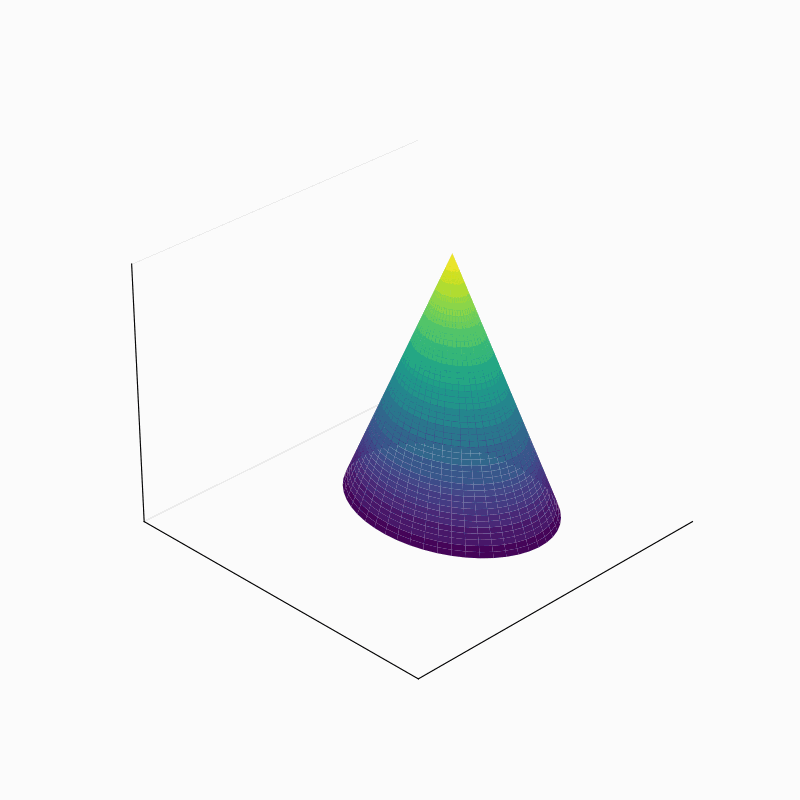

# Flatgeobuf VectorDB
A single static file as high throughput vector database, using the cloud-native flatgeobuf file format and http range requests. 

## What is this? 
This is a simple proof of concept repository for using the flatgeobuf file format as static vector database for text and image embeddings, e.g. for lean retrieval augmented generation workflows. It is **not** about geodata and normal flatgeobuf usage!

The magic lies in the way you can use it: just dump the single static flatgeobuf file containing millions of embeddings anywhere and access it through normal http range requests for retrieving just the data you need. No backend and no database connection needed. A standard web server like nginx or caddy will do.

For example, you can dump the file on GitHub or HuggingFace and just start using it. As it's only a static file on the server that the web server accesses, it's incredibly performant out of the box. 

## How?
The idea is, that both all the embedding vectors and a query vector are projected on a 2D plane in the same way independently from each other and at different times. The assumption is, that points that lie close to the query point on the 2D place are more related to the query point than far away points.

Flatgeobuf is optimized for rectangular bounding boxes. With flatgeobuf clients, you can automatically send the respective http range requests to the server where the .fgb file is hosted. Then, the server returns only the data within the bounding box.

In the image below, dark points are related points to the query point and light ones are rather unrelated. Imagine a small rectangular bounding box around the query point. This would be the subset you retrieve.


### Projections
How can you reduce the high-dimensional vectors to 2D? There are tons of great algorithms like tSNE, PCA, UMAP, HUMAP etc. but we can only use algorithms here that respect a particular feature. When using tSNE, PCA or HUMAP you assume, that you are working on a full dataset as you are just interested in the relations and similarities between the points. However, as we are working towards a setup where all kinds of queries - so unknown vectors - can occur, the algorithm needs to be agnostic to the relations between the vectors. 
In simple terms: we can only use UMAP or so-called projections. 

What are projections? 

Imagine a swarm of bees (objects in 3D space) in your room. You light a torch (origin of the projection) and the bee shadows cast on the wall (points in 2D space, a plane) are the projections. We reduced a vector with length 3 to length 2. The beauty of this analogy is, that if the position of bee, torch and wall remains the same, the shadow is always cast at the same position - the exact characteristic we were looking for! 

## Writing flatgeobuf vector DB file 
Great, so all we do now is to CREATE the flatgeobuf vector DB is:
- for a dataset, create normal embeddings
- then project the embeddings with an arbitrary number of dimensions (=length) to a 2D plane with X and Y coordinates
- create the flatgeobuf file by using X and Y coordinates as fake lat lon (with some geographic projection)
- dump the file somewhere

## Reading flatgeobuf vector DB file 
READING is slightly more complex:
- create the query embedding
- project it again to a 2D place (same settings as used for writing of course)
- create a bounding box with some buffer around this 2D point
- send the request with any flatgeobuf client (Python, JS, Rust, Go...) and receive the data subset, e.g. 100 out of 10.000 points
- calculate the cosine similarity (or any other distance function) client-side to re-order the received data

If you have questions/doubts/critique at this point just read on... ;)

## Results
Well, this repo is a POC at the moment. But even in this most basic version without any optimizations and from the handful of manual tests I ran, it seems to work (which is the only reason I'm actually setting up this GitHub Repo)! 

See the example code for more details, but in a nutshell: 

- Used 2905 short BAAI/bge-m3 embeddings from "Alice’s Adventures in Wonderland" and ran the 2D flatgeobuf writing workflow
- Query: `observing animals in the wild` with bbox span of `0.3` (pretty random, low value)
- Returned 25 embeddings out of which the top ranking one was amongst the top 3 in the whole dataset!

```python
QUERY = "observing animals in the wild"
query_emb = model.encode(QUERY, batch_size=12, max_length=2048)['dense_vecs']
query_2d = reduce_to_2d(query_emb)
query_bbox = create_bbox_from_point(query_2d, 0.3)

features = []
with open("alice.fgb", "rb") as f: # retreive parts of the file from disk or via http request
    reader = fgb.Reader(f, bbox=query_bbox)
    for feature in reader:
        features.append(feature)

gdf = gpd.GeoDataFrame(features) 
gdf["text"] = gdf["properties"].apply(lambda x: x["text"])
gdf["embeddings"] = gdf["properties"].apply(lambda x: x["embeddings"])
del gdf["properties"]
gdf["cosine_similarity"] = gdf["embeddings"].apply(lambda x: cos_sim(np.array(ast.literal_eval(x.replace("  ",","))), np.array(query_emb))) # dirty tricks as fgb does not support arrays as type (but json, need to explore)
del gdf["embeddings"]
print("Retrieved datapoints: ", len(gdf))
gdf.sort_values("cosine_similarity",ascending=False, inplace=True)
gdf
```

Response with 25 data points. Cosine similarity calculcated client-side and ranked:

|    | text                                                                                                            |   cosine_similarity |
|---:|:----------------------------------------------------------------------------------------------------------------|--------------------:|
| 24 | birds and animals that                                                                                          |            0.728023 |
| 17 | wandering, when a sharp                                                                                         |            0.680383 |
| 15 | of it; so, after hunting                                                                                        |            0.633657 |
|  8 | thoughtfully at the mushroom                                                                                    |            0.581669 |
| 10 | the fan and the pair                                                                                            |            0.571449 |
| 23 | mushroom, and her eyes                                                                                          |            0.569117 |
|  6 | growing near her, about                                                                                         |            0.568814 |
|  4 | was walking hand in hand                                                                                        |            0.562929 |
| 22 | back the wandering hair                                                                                         |            0.562181 |
|  2 | the mushroom, and crawled                                                                                       |            0.55456  |
| 20 | The March Hare took the                                                                                         |            0.539242 |
|  0 | flowers and those cool                                                                                          |            0.532989 |
| 18 | and growing, and very                                                                                           |            0.527654 |
|  9 | with an M, such as mouse                                                                                        |            0.521849 |
| 21 | not appear, and after a minute or two she walked on in the direction in which the March Hare was said to live.  |            0.517969 |
| 13 | How funny it’ll seem to come out among the people that walk with their heads downward!                          |            0.502964 |
| 16 | “Well, then,” the Cat went on, “you see, a dog growls when it’s angry, and wags its tail when it’s pleased.     |            0.494376 |
|  1 | the question, and they                                                                                          |            0.490156 |
| 19 | The Hatter looked at the March Hare, who had followed him into the court, arm-in-arm with the Dormouse.         |            0.47043  |
|  5 | , mostly Kings and Queens                                                                                       |            0.465025 |
|  3 | Game, or any other dish?                                                                                        |            0.454374 |
| 14 | said the Hatter. “You might just as well say that ‘I see what I eat’ is the same thing as ‘I eat what I see’!”  |            0.443848 |
| 12 | Let me see: four times five is twelve, and four times six is thirteen, and four times seven is—oh dear!         |            0.430301 |
| 11 | the garden: the roses growing on it were white, but there were three gardeners at it, busily painting them red. |            0.424858 |
|  7 | Do cats eat bats?” and sometimes, “Do bats eat cats?”                                                           |            0.41304  |

The top 5 entries of the whole dataset where number 3 was number 1 from the table before:

|      | text                     |   cosine_similarity |
|-----:|:-------------------------|--------------------:|
| 2278 | the look of the creature |            0.739605 |
| 2112 | up by wild beasts and    |            0.728607 |
| 2902 | birds and animals that   |            0.728023 |
| 1609 | Turtle in the distance   |            0.721267 |
| 2596 | Rabbit coming to look    |            0.720095 |


This is kind of cool that you can use existing cloud-native components and just hack your way together without reinventing the wheel. It sort of worked - hurray! 🎉

## Use Cases 
Well, theoretically this could be very performant when the database is huge, with millions of records or more and you can have tens of thousands of concurrent requests, easily handled by a single nginx or caddy. This could dramatically reduce costs or even be used in some kind of pipeline. 

An actual use case could be porduct recommendations where it mustn't be the top most similar product, but something fairly related would do too. I heard Amazon recommendations had become spookingly good so they had to drop in some nonsense in order not to scare people too much...

## Discussion 

Okay, so far I tried not to talk about the tons of drawbacks and needed optimizations in this workflow but let's do so now. 

### Pros
- it sort of works but needs further evaluation
- you can dump the file anywhere and query it with any client, basically no maintanance required, pretty fail-proof
- should be as performant as the webserver gets, so VERY performant in theory
- database (fgb file) can be updated with more points gradually, no re-indexing needed

### Things to explore 
There are so many things to explore here yet so I do not want to call this section "Cons" unless I know it's an actual con. 

- the current projection method is weak in comparison to tSNE or PCA but I am not (yet) aware of any better suitable method here
- there's a "corridor" problem crated by UMAP:


- it can be improved however by first transforming the cone-like structure to a cylinder and then "unrolling" the cylinder to a plane like here for fixing the problem, that unrelated points are to close to related points in the very center (don't mind the ugly unrolling please):



- maybe self-organizing maps or similar spatial index methods suitable?
- I know that bge-m3 embeddings are good, but they still might have a bias/weaknesses that might falsify the results here
- I read some discussions on HN that apparently http range requests are not as performant as requests for static files
- if so, one could also try to come up with an efficient R-Tree like file structure dumping files in directories that are organized accordingly but tbh I'm a big fan of protomaps too, so I like the one-file-approach a lot
- the "span" param in the create_bbox_from_point function is crucial. If too low, nothing will be returned, if too high, all the DB. Workaround: start very low and increase with a certain (maybe logarithmic?) factor until N points are returned (or e.g. X% of the DB?)
- need to explore other mature clients and run some performance benchmarks
- much more I guess

## Contributions 
I need your help. I'm developing lots of different things at the moment, all in my free time, all unpaid. Please reach out to me for whatever kind of contributions: 
- ideas
- code
- performance benachmarks
- scientific cooperations, if you'd like to work together to write a paper that'd be incredibly much appreciated

Feel free to reuse the code in this repo for whatever you like, but please reference me or this repo. I invested countless hours in open source software and would love to get a shoutout back. Also, please open an issue/discussion if you tried it or used it somewhere just so I know that it's actually beeing used :) 

And of course: wouldn't mind that star! ;)
